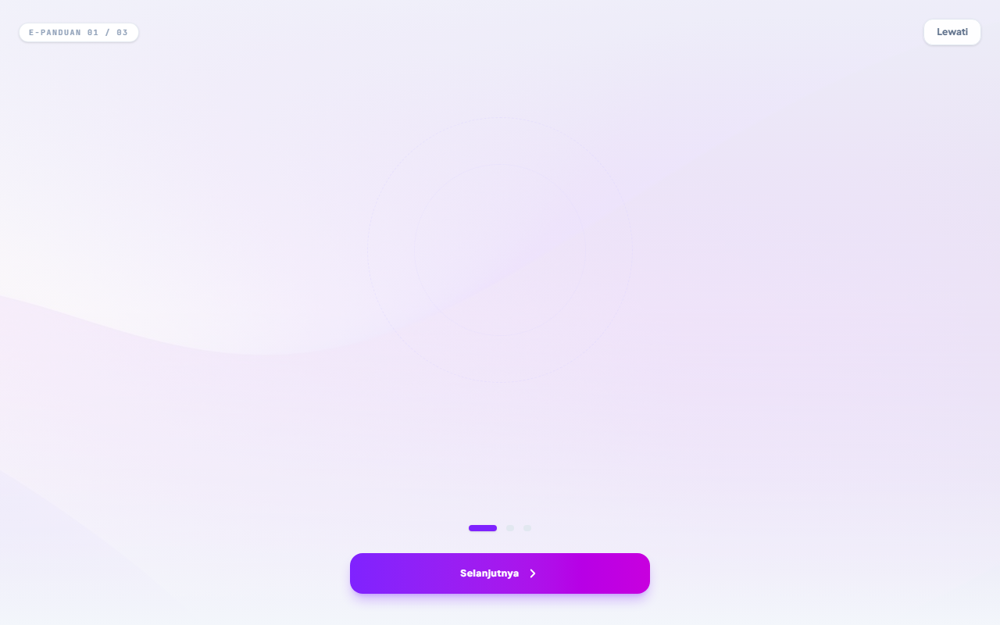

# 🎪 EventSpace - Premium Event Booth Rental Platform

<div align="center">
  
  <p><strong>Platform Digital Terintegrasi untuk Penyewaan Slot Booth Event, Bazar, Festival, dan Pameran.</strong></p>
  
  <a href="https://event-space-v3.vercel.app">
    
  </a>
  <a href="https://github.com/ekelmekel4-ux/Event-Space">
    
  </a>
</div>

---

## 📸 Tampilan Aplikasi

Berikut adalah halaman onboarding saat pengguna pertama kali mengakses **EventSpace**:

<div align="center">
  
</div>

---

## 🔗 Tautan Penting
* **Link Aplikasi Live:** [https://event-space-v3.vercel.app](https://event-space-v3.vercel.app)
* **Link Repositori:** [https://github.com/ekelmekel4-ux/Event-Space](https://github.com/ekelmekel4-ux/Event-Space)

---

## 🌟 Fitur Utama

EventSpace dirancang untuk mempermudah kolaborasi antara **Event Organizer (EO)** dan **Tenant (UMKM/Brand)** melalui fitur-fitur berikut:

### 🏪 Untuk Tenant (Penyewa)
* **Cari & Filter Event:** Cari event berdasarkan kategori seperti *Bazar, Festival, Pameran UMKM,* dan *Mall*.
* **Peta Slot Booth Interaktif:** Pilih nomor slot booth secara visual langsung dari ketersediaan yang ada.
* **Sistem Pembayaran Instan:** Pembayaran menggunakan QRIS (disertai penghitung waktu mundur), Bank Transfer/Virtual Account, dan E-Wallet.
* **Notifikasi Status Real-time:** Dapatkan informasi langsung ketika pendaftaran disetujui atau ditolak oleh panitia.

### 🎪 Untuk Event Organizer (Pengelola)
* **Manajemen Event:** Tambah, edit, draft, atau selesaikan event.
* **Verifikasi Pembayaran & Pendaftaran:** Sistem admin khusus untuk menyetujui atau menolak bukti pembayaran sewa booth dari tenant.
* **Analisis & Laporan Keuangan:** Dashboard analitik dengan visualisasi grafik pendapatan serta opsi cetak laporan keuangan ke format PDF.

---

## 👥 Akun Demo untuk Uji Coba

Untuk memudahkan pengujian fungsionalitas kedua peran (role), Anda dapat masuk menggunakan akun demo berikut:

| Peran (Role) | Email | Kata Sandi (Password) | Keterangan |
|---|---|---|---|
| **Tenant** | `younjung@gmail.com` | `tenant123` | Digunakan untuk menyewa booth, upload bukti bayar, dll. |
| **Organizer (Admin)** | `admin@eventspace.com` | `admin123` | Digunakan untuk mengelola event & memverifikasi pendaftaran. |

---

## 🛠️ Spesifikasi Teknologi

* **Frontend:** React (Vite, TypeScript, Tailwind CSS, Lucide Icons, Framer Motion)
* **Backend:** Express + Node.js (digabungkan secara *serverless* menggunakan tsx)
* **Database & Storage:** Supabase Integration
* **Hosting Platform:** Vercel

---

## 🚀 Cara Menjalankan Proyek Secara Lokal

Ikuti langkah-langkah di bawah ini untuk menjalankan EventSpace di komputer lokal Anda:

### Prerequisites (Prasyarat)
* Pastikan Anda sudah menginstal [Node.js](https://nodejs.org/).

### Langkah-langkah Instalasi
1. Clone repositori ini:
   ```bash
   git clone https://github.com/ekelmekel4-ux/Event-Space.git
   cd Event-Space
   ```

2. Instal dependensi:
   ```bash
   npm install
   ```

3. Duplikat file `.env.example` menjadi `.env.local` dan isi dengan konfigurasi kredensial API Anda:
   ```bash
   cp .env.example .env.local
   ```

4. Jalankan server lokal:
   ```bash
   npm run dev
   ```
   Aplikasi akan berjalan di `http://localhost:3000` (atau port default yang tertera di terminal Anda).
